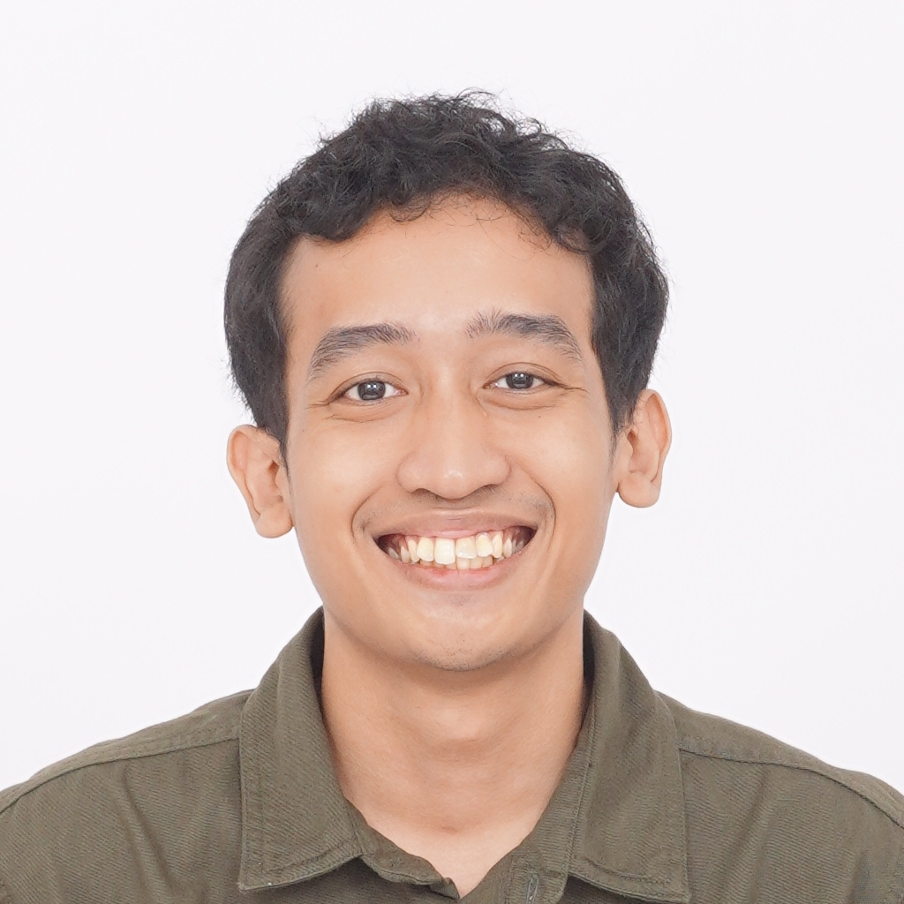

# About

{ align=left, width="150", loading=lazy }

Hi there!

I'm Tito, currently pursuing my PhD at Tohoku University's [Neuro-Robotics Lab](https://neuro.mech.tohoku.ac.jp/). My research interest is in learning, perception, and control for legged robots.

I hold an M.Sc. (Control Engineering) and a B.Sc. (Biomedical Engineering) from [Bandung Institute of Technology (ITB)](https://itb.ac.id), Indonesia. My master's thesis was on radar-camera-based perception for autonomous vehicles, while my bachelor's thesis was about autonomous UV disinfection robots. I was also a researcher at ITB's autonomous tram project and the team lead of ITB's autonomous soccer robot team [Dagozilla](https://dagozilla.itb.ac.id/).

Outside of academia, I have worked as a robotics engineer, developing autonomous mobile robots. I also have some experience in computer vision, deep learning, and sensor fusion.

On my free time, I like to draw illustrations, play video games, and study Japanese.

Check out my [[Blog|blog]] if you are interested.

---

## Contact

Feel free to reach me via email.

- :simple-gmail: [irfantitok@gmail.com](mailto:irfantitok@gmail.com)
- :simple-github: [Github](https://github.com/titoirfan)
- :simple-googlescholar: [Google Scholar](https://scholar.google.com/citations?user=t06n5FYAAAAJ)
- :simple-linkedin: [LinkedIn](https://www.linkedin.com/in/titoirfan/)