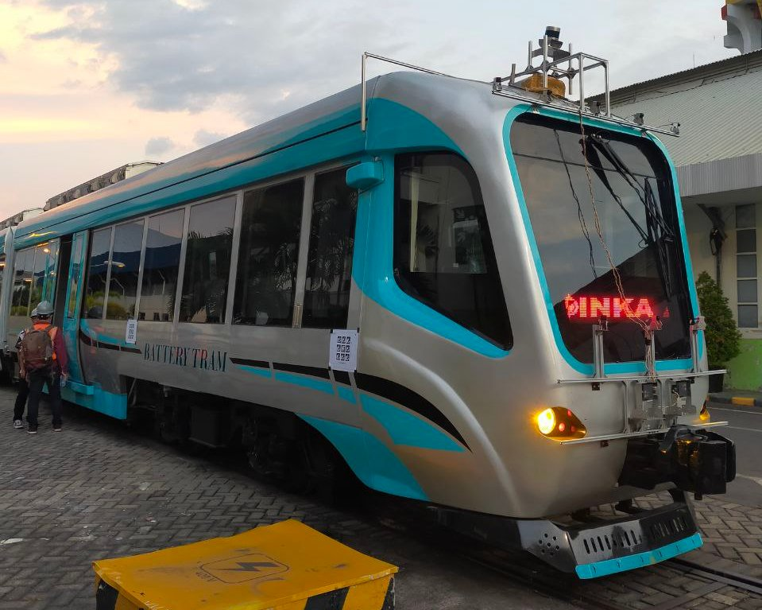
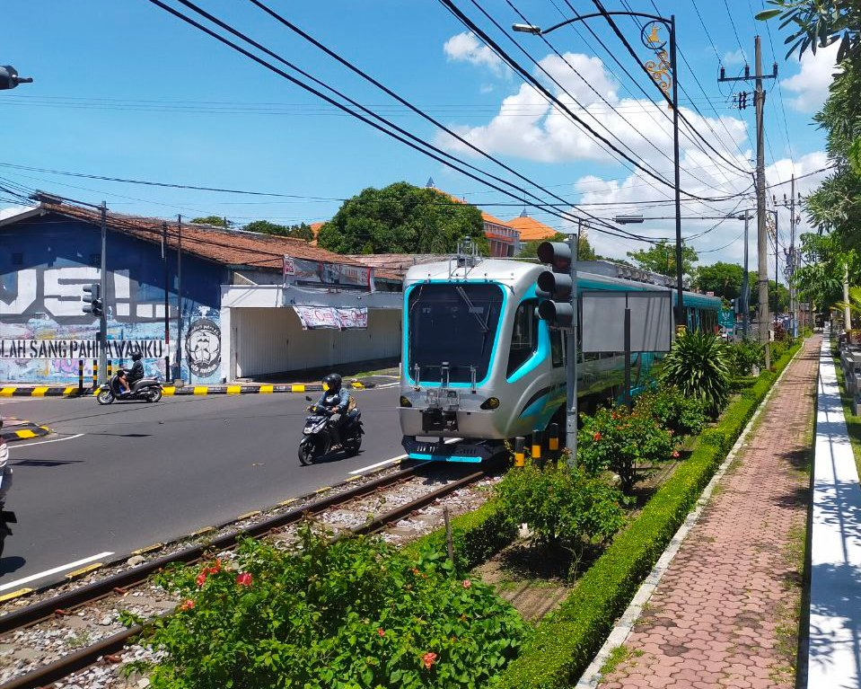
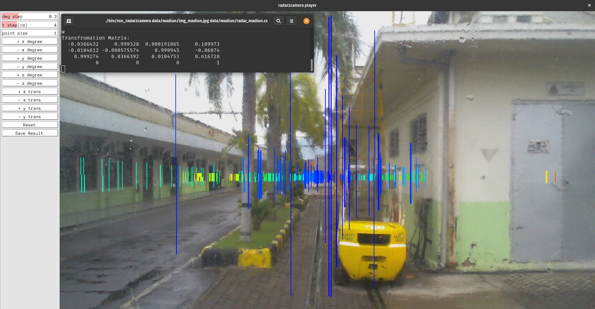
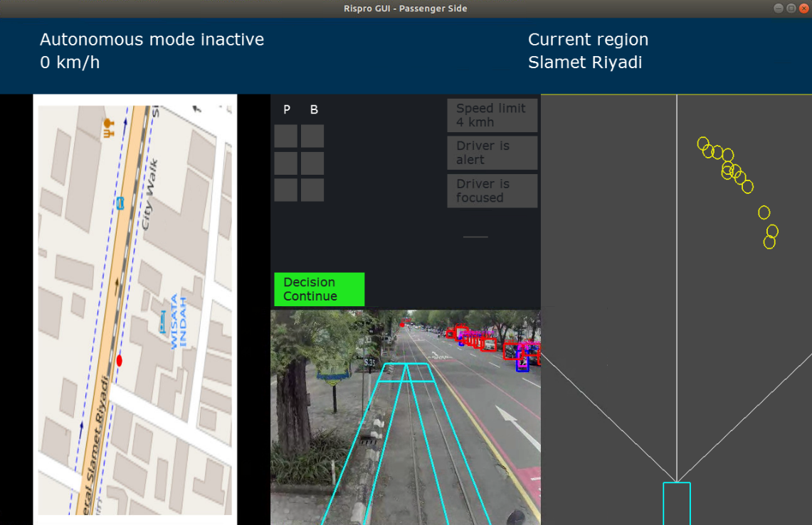

---
hide:
  - footer
---

# Autonomous Tram

*An autonomous tram developed in cooperation with the Indonesian Railway Industry Company (PT INKA) and PT Riset Kecerdasan Buatan (PT RKB).*

---

{ width="560" }
{ width="560" }
/// caption
The tram with cameras, lidar, and radars attached to its front face
///

The [**autonomous tram**](https://av.itb.ac.id/) was a joint project between [**Bandung Institute of Technology**](https://itb.ac.id/) (ITB), the [**Indonesian Railway Industry Company**](https://www.inka.co.id/) (PT INKA), and [**PT Riset Kecerdasan Buatan**](https://www.riset.ai/) (PT RKB) and was funded by the **Indonesian Ministry of Finance** under the [**RISPRO LPDP**](https://risprolpdp.kemenkeu.go.id/) research funding program. I worked on the autonomous tram as a research assistant from ITB during my time as a master's student there. The project aimed to develop a battery-powered autonomous tram for use in the mixed-traffic environment of Surakarta, Indonesia. The tram has to be able to navigate and drive itself safely by relying solely on its onboard sensors and computer, without the help of any marker or tags placed in the environment.

The tram carries multiple sensors of different modalities: **9 cameras**, **a lidar**, **2 radars**, **a GNSS**, and **an IMU**. All the sensors communicate with the tram's **NVIDIA DRIVE AGX** embedded computer which interfaces with the tram's PLC. In the project, I was responsible for the tram's **radar-based perception system**, a part of which was my master's thesis, and the **tram's overall system integration**.

## The Radar-Based Perception System

I was responsible for everything related to radar in this project, from the electrical wiring to the deep learning model implementation on embedded systems. In the tram's perception system, the radar is used to help perform 3D object detection due to its ability to measure objects' depth and velocity directly. We used **Continental ARS430RDI automotive radars** in this project. I wrote my own **ethernet packet parser** for the radar as Continental did not provide any software to access the data sensed by the radar.

Due to the sparse nature of radar point clouds, the accuracy of the current state-of-the-art radar 3D object detection methods is very poor compared to methods that utilize other sensors like cameras or lidars. Thus, radar is often used to support or complement other sensors instead of being used as a standalone sensor. In this project, the radar is paired with a **Sekonix SF3325 RGB camera**. As radar-camera automatic extrinsic calibration methods are not too well studied and often require a lidar and a custom-made marker, we opted to use a manual calibration method instead. I adapted [OpenCalib](https://github.com/PJLab-ADG/SensorsCalibration) to our use case, converting the point clouds into clouds of fixed-size pillars to make the calibration process easier and fixed several transformation equations. The radar-camera extrinsic calibration process using our custom software is illustrated below.

/// caption
The calibration process using our custom software
///

We implemented [**CenterFusion**](https://github.com/mrnabati/CenterFusion), a feature-level fusion approach to radar-camera 3D object detection, on the NVIDIA DRIVE AGX. As some of the key parts of the architecture are not neural networks, they have to be implemented manually so that they can be processed efficiently on the GPU. We **adapted** the [TensorRT implementation by HaohaoNJU](https://github.com/HaohaoNJU/CenterFusion) to be compatible with **our sensor hardware** and to use the **NVIDIA DriveWorks** software framework. We changed the backbone to [**DLAv0**](https://arxiv.org/abs/1707.06484) and added the capability of outputting 2D bounding boxes and velocity. We also incorporated amodal offsets in the postprocessing step for a more accurate localization, especially for objects that are truncated in the image.

The **embedded implementation** was written in **C++** and **CUDA C++** using the **TensorRT** framework. It loads a model that was trained on the **nuScenes dataset**. Due to us not having any annotated radar data at the ready, we did not perform transfer learning on the model. The model training itself was done on an **NVIDIA DGX-1** using a **PyTorch** and **OpenCV**-based **Python** model implementation and training script.

The embedded implementation can run at **24 FPS on the NVIDIA DRIVE AGX**. A sample scene showing the object detection performance of the model on the nuScenes dataset and the new data distribution taken in Bandung, Indonesia is shown below.

/// caption
A sample scene showing the object detection performance on the nuScenes dataset. Inferred on the NVIDIA DRIVE AGX at 24 FPS
///

/// caption
A sample scene showing the object detection performance on a new data distribution taken in Bandung, Indonesia. Note that no transfer learning was performed. Inferred on the NVIDIA DRIVE AGX at 24 FPS
///

## The Tram's System Integration

Aside from the tram's radar-based perception system, I was also responsible for helping integrate the tram's many independent subsystems into a single complex system. Among the subsystems I helped integrate into the main routine were the decision-making and the visualization subsystem. I also wrote the first version of the tram's graphical user interface and image-based decision-making system illustrated below.

/// caption
The first version of the tram's graphical user interface
///

[[projects/index|Back to Projects]]