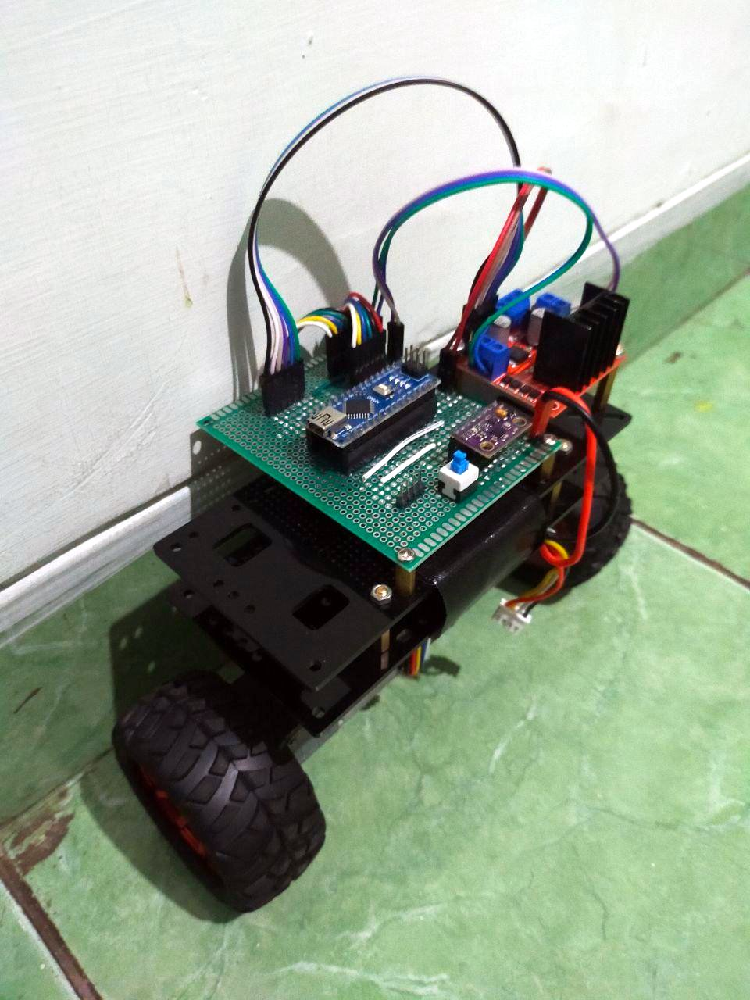
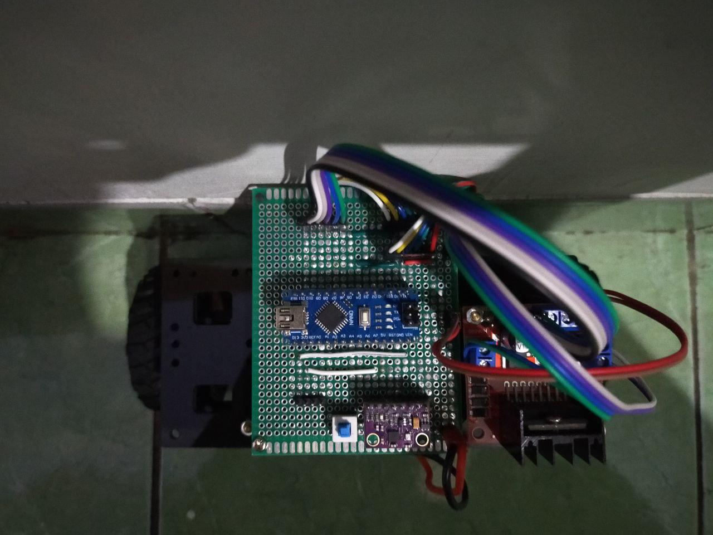

---
hide:
  - footer
---

# Self-Balancing Robot

*A two-wheeled self-balancing robot that can keep itself upright and be controlled using a joystick.*

---

{ width="300" }
/// caption
The two-wheeled self-balancing robot
///

The **Self-Balancing Robot** was built as my EL5214 Embedded Control Systems course final project, taken during my master's at Bandung Institute of Technology (2021). This robot is designed to balance itself upright robustly even in the presence of disturbances. The robot receives motion commands through a wired joystick.

{ width="300" }
/// caption
The robot's main electric circuitry which consists of an Arduino Nano, an MPU9250 IMU, and an L298N motor driver
///

The robot uses an **Arduino Nano** as its main computing unit and an **MPU9250** IMU as its orientation sensor. The robot is actuated by a pair of **JGA25** brushed DC motors controlled by an **L298N** motor driver. The gyroscope and accelerometer sensor readings from the IMU are fed into a **complementary filter** to estimate the robot's orientation. 

The Arduino is running a **PID controller** to regulate the robot's orientation. A **finite state machine** (FSM) is used to process joystick inputs into orientation setpoints to be tracked by the PID controller. The PID controller uses the output of the complementary filter as orientation feedback. The controller outputs PWM duty cycles to be given to the motor driver. The dead zone of the motors is compensated by setting the lower bounds of the PWM duty cycles to a tunable value higher than zero.

Below are some GIFs showing the robot balancing itself. Even in the presence of disturbances, the robot is able to keep itself upright.

/// caption
The robot balances itself even in the presence of disturbances
///

The robot can also follow motion commands given through the wired joystick as shown in the following GIFs.

/// caption
The robot balances itself while following motion commands given through the joystick
///

[[projects/index|Back to Projects]]