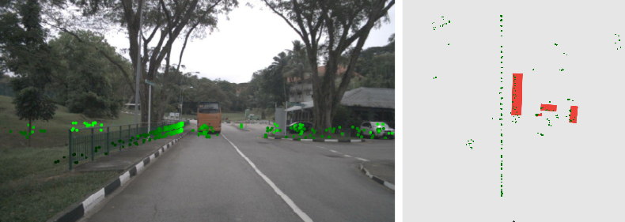
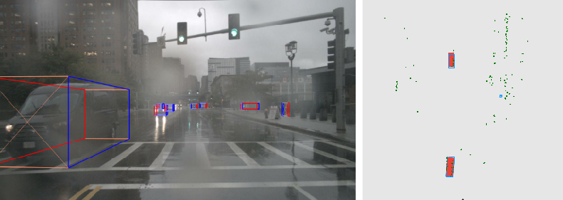
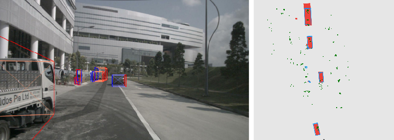

---
hide:
  - footer
---

# Clusterfusion

*A radar-monocular camera fusion-based 3D object detector for autonomous vehicles. Achieved state-of-the-art performance among similar methods on the nuScenes detection leaderboard.*

---

/// caption
A monocular camera image and a projected radar point cloud (left); the same point cloud viewed from above and ground truth object bounding boxes (right). It is easier to approximate the objects' shape from the point cloud in the top view than in the image perspective view.
///

**ClusterFusion** is a **radar-monocular camera feature-level fusion-based 3D object detector** that leverages the local spatial and point-wise features of radar point clouds. I developed ClusterFusion as a part of my master's thesis at Institut Teknologi Bandung under the supervision of Prof. Bambang Riyanto Trilaksono.

As illustrated in the Figure above, the shape of the objects can be approximated by observing the geometry of the radar point cloud. It is relatively harder to do the same in the image perspective view, where the point cloud's depth dimension is flattened. Existing radar-monocular camera methods only extract the point-wise features from the point clouds and ignore the point clouds' geometry which contains information on the position, orientation, and dimensions of the objects. Some other methods project the point clouds onto images and add the sparse radar depth as an additional channel, making it harder to extract the geometric information from the point clouds.

ClusterFusion makes the most out of the radar point clouds' local spatial and point-wise features by clustering the radar point cloud and performing feature extraction directly on the radar clusters, minimizing information loss. ClusterFusion uses a CenterFusion-inspired (Nabati and Qi, 2021) frustum-based association mechanism to form radar clusters along with a handcrafted radar cluster feature extraction method. The radar features are then fused with the image features on the image plane to obtain the fused feature maps that are processed further. The general block diagram of the ClusterFusion architecture is shown in the Figure below.

/// caption
ClusterFusion's architecture, best viewed in light mode.
///

At the time of publication, ClusterFusion achieved the **state-of-the-art performance** among all the radar-monocular camera methods on the **nuScenes' detection leaderboard** with a **nuScenes detection score (NDS) of 48.7%**. ClusterFusion was written in **Python** using **PyTorch** and **OpenCV**. More details regarding ClusterFusion, along with an investigation of the performance of different feature extraction strategies on radar point cloud clusters, can be found in the paper [**"ClusterFusion: Leveraging Radar Spatial Features for Radar-Camera 3D Object Detection in Autonomous Vehicles"**](https://doi.org/10.1109/ACCESS.2023.3328953) (Kurniawan and Trilaksono, 2023). The paper has been published in the open access IEEE Access journal.

/// caption
Sample ClusterFusion detection results on data from the nuScenes dataset.
///