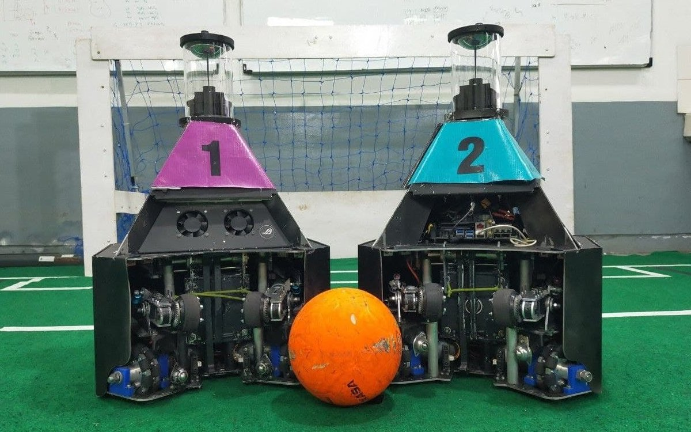
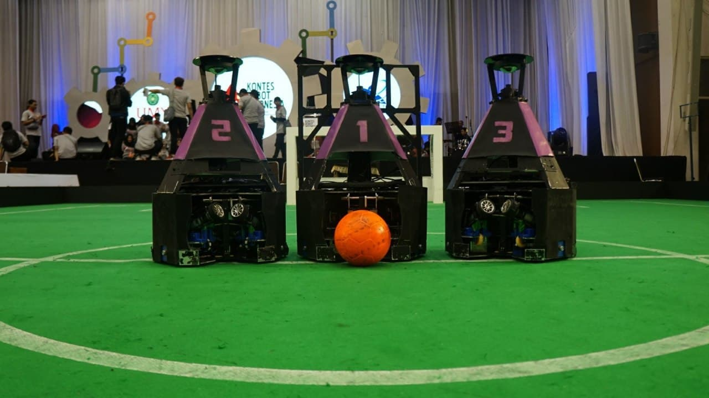

---
hide:
  - footer
---

# Dagozilla

*Two generations of autonomous mobile soccer robots designed for the RoboCup Middle Size League.*

---

/// caption
*Dagozilla's third generation autonomous soccer robots*
///

<iframe width="560" height="315" src="https://www.youtube.com/embed/1zRVFqljGJ8?si=V8EFhvzX0zlND_Tw" title="YouTube video player" frameborder="0" allow="accelerometer; autoplay; clipboard-write; encrypted-media; gyroscope; picture-in-picture; web-share" referrerpolicy="strict-origin-when-cross-origin" allowfullscreen></iframe>

Dagozilla is the autonomous mobile robot developer student team of Bandung Institute of Technology, developing autonomous mobile soccer robots to compete in the RoboCup Soccer Middle Size League (MSL). In 2019, I was elected as the team leader of Dagozilla, responsible for leading the development of the team's third-generation autonomous mobile soccer robots. By the end of 2020, we managed to build two striker robots and were qualified for RoboCup MSL 2020. Unfortunately, we did not get to compete as the competition was canceled due to the COVID-19 pandemic.

The robots can autonomously play soccer using only the sensors they have onboard. They rely on an omnidirectional camera as their main sensor, which is supported by other sensors such as rotary encoders and a compass. The robots localize themselves against a map of the field's lines using the Augmented Monte Carlo Localization (AMCL) algorithm.

The robots use the A* algorithm to generate path plans. From the path plans, they generate velocity setpoints using a trapezoidal velocity profile, which are then tracked using PID controllers. The robots can kick a soccer ball through the use of a solenoid-based kicking mechanism. The kicking mechanism can deliver both a lob shot and a flat shot. They can also actively control a ball thanks to their dribbling mechanism.

/// caption
*The robots in action*
///

During a match, each robot follows a strategy implemented using behavior trees. Each robot follows a different strategy designed according to its role. This way, the robots can cooperate while being aware of their individual role. The striker robot focuses on offense while the defender robot covers the back area, but they can also both work together in defense or offense when needed.

Hardware-wise, the robot uses both an x86-64 PC and an STM32F767ZI microcontroller. The microcontroller runs lower-level control loops and interfaces with the sensors and actuators. The PC handles everything else including communication, behavior, localization, and higher-level control.

As the team leader, I was in charge of leading the overall research, development, and manufacture of the robot. My team leader duties included both the technical and non-technical aspects of it. Aside from my team leader duties, I was in charge of the robot's control system. I designed and implemented the robot's motion and actuator control, from the high-level control algorithms to the low-level embedded hardware control.

/// caption
*The robot delivering a lob shot in slow-motion*
///

When I first began working for the team, the team was improving the second-generation robot's performance. As an electrical engineer, I was responsible for designing the PCBs used in the robots and improving the robot's sensor and control system performance. In the competitions, I was responsible for the defender robot.

/// caption
*Dagozilla's second generation autonomous soccer robots*
///

[[projects/index|Back to Projects]]