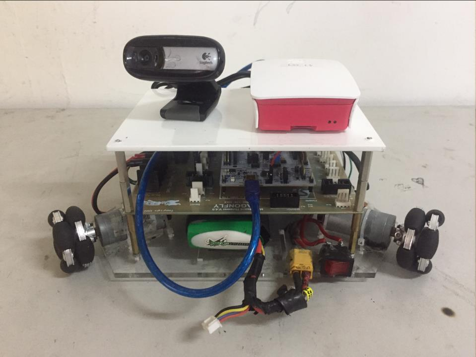

---
hide:
  - footer
---

# Security Guard Robot

*A mini security guard robot that patrols the environment for unknown or wanted faces and warns human guards when one is found.*

---

{ width="560" }
/// caption
The security guard robot
///

The **Security Guard Robot** was my EL4126 Robotics course final project, taken during my bachelor's at Bandung Institute of Technology (2019). This robot is designed to patrol a predetermined route while performing face detection and recognition. The robot will then make noises and alert the human guards when any unknown face or a wanted face is detected.

The robot was developed using the **Robot Operating System (ROS)** framework, ran on a **Raspberry Pi Model 3B+** alongside an **STM32 microcontroller**. The robot moves around on a holonomic three-wheeled platform. The face detection and recognition is done on footages captured by a Logitech webcam. The face detection is done using **Haar cascades** and the face within each bounding boxes is then recognized using **Eigenfaces**. All the computer vision programs is implemented with the help of the **OpenCV** library.

[[projects/index|Back to Projects]]