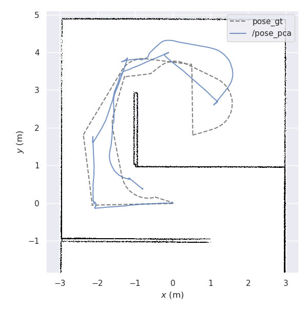
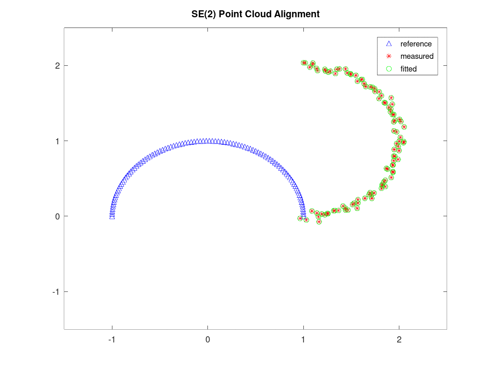
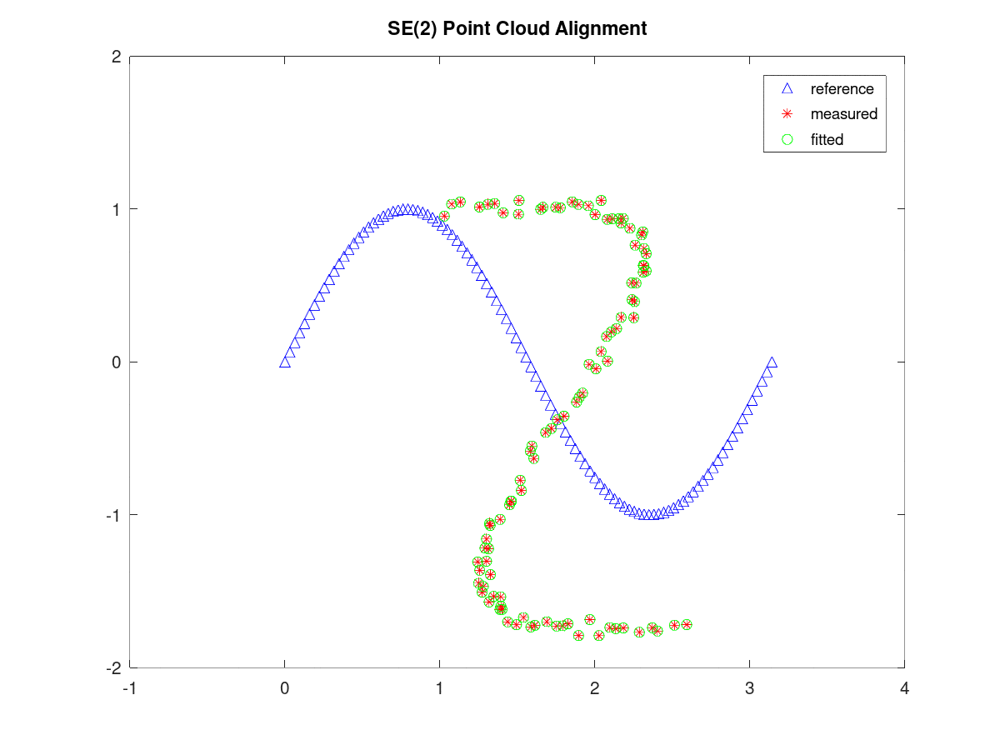
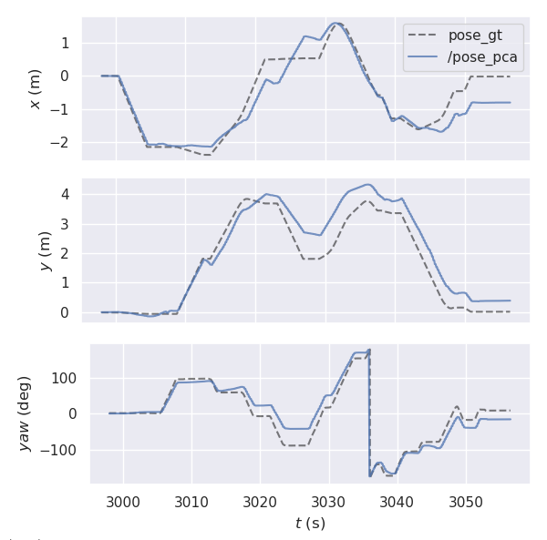

---
hide:
  - footer
---

# Scan Matching-based 2D Lidar Odometry

*A simple scan matching-based 2D lidar odometry Robot Operating System (ROS) node. The scan matching is solved using the iterative closest point (ICP) algorithm, implemented in C++ using Eigen.*

---

/// caption
*A sample trajectory estimated by the lidar odometry compared against the ground truth trajectory*
///

The **scan matching-based 2D lidar odometry** Robot Operating System (ROS) node was written as the final project for the EL5000 Advanced Mathematics course, taken during my master's in Bandung Institute of Technology (2020). It was written in C++ using the Eigen library and implements the **iterative closest point** (ICP) algorithm. As a mathematics course final project, this project was written mainly to demonstrate how **singular value decomposition** (SVD) can be used to solve the point cloud alignment problem and is not meant to be an implementation suitable for real-world use. A proof of concept of the algorithm was implemented in Octave and is illustrated below.

/// caption
*Illustrations of the Octave proof of concept implementation of the ICP algorithm*
///

The correspondences between the two point clouds are made using **naive nearest neighbor searches**. All **correspondence pairs** are **weighted equally** and **no outlier rejection** is performed. The translation vector between the point clouds is obtained by calculating the position difference between the centroids of both point clouds. The rotation matrix is extracted using SVD. To accelerate computations, all input point clouds are **subsampled** beforehand.

The ICP C++ implementation is then wrapped in a ROS node which subscribes to an input 2D laser scan topic and publishes the resulting calculated odometry. The implementation is tested on a set of sample 2D lidar data taken in Gazebo and is evaluated against the ground truth trajectory using the [evo odometry evaluation package](https://github.com/MichaelGrupp/evo). The following figures show the estimated and ground truth trajectories as well as the position and orientation comparison at every time step.

/// caption
*An evaluation of the lidar odometry implementation on a sample trajectory*
///

[[projects/index|Back to Projects]]