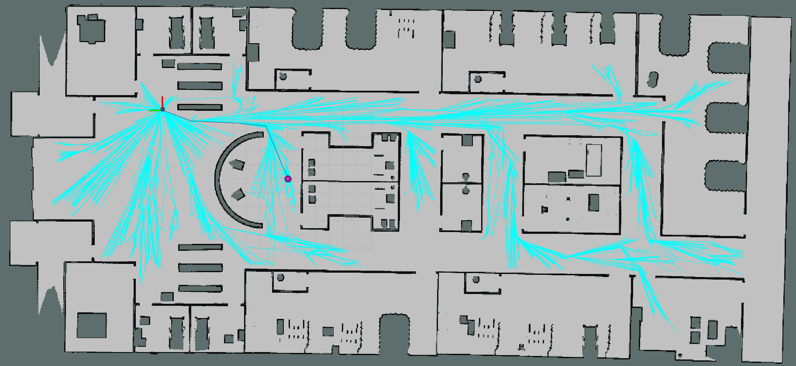

---
hide:
  - footer
---

# Soca

*An autonomous ultraviolet-C germicidal irradiation robot. Built in simulated environment using ROS and Gazebo.*

---

/// caption
Surface irradiation simulation
///

<iframe width="560" height="315" src="https://www.youtube.com/embed/DIwOiWrwsZ8?si=lBd3nLtX9VzA_FrA" title="YouTube video player" frameborder="0" allow="accelerometer; autoplay; clipboard-write; encrypted-media; gyroscope; picture-in-picture; web-share" referrerpolicy="strict-origin-when-cross-origin" allowfullscreen></iframe>
/// caption
///

**Soca** is my undergraduate thesis, a solo project to develop an autonomy software for ultraviolet-C germicidal irradiation surface disinfection robots. Soca is designed to be modular and hardware agnostic. However, we use a simulated custom-built robot based on the TurtleBot3 platform that carries a **2D Lidar** and a **Magnetic, Angular Rate, and Gravity (MARG)** sensor as our testing platform. To use this robot, the user can simply request the robot to disinfect a room by passing the room name to the robot.

To reduce the computation load, Soca does not perform SLAM, and instead uses a fixed map for its localization and navigation needs. The map is built beforehand using **Google Cartographer**. Soca uses the **Augmented Monte Carlo Localization (AMCL)** algorithm to localize itself with respect to the map. For its navigation needs, Soca uses the **Rapidly Exploring Random Tree\* (RRT\*)** algorithm as its path planner and the **Spanning Tree Coverage (STC)** algorithm as its coverage path planner.

/// caption
The RRT* algorithm in action
///

To reduce unnecessary complexities, we wrote our own C++ implementation of the localization and navigation stack, which includes the AMCL, RRT*, and STC algorithms. We wrote the program using the **Robot Operating System (ROS)** framework. To accompany the robot, we also wrote a graphical user interface for the user to give the robot commands using **Qt**. 

Finally, we tested and evaluated Soca in a simulated environment. As ultraviolet surface irradiation is not traditionally supported in Gazebo, we developed our own method to simulate it, which is described in greater depth in this <a href="https://ieeexplore.ieee.org/abstract/document/9501868" target="_blank">paper</a>. We open-sourced our implementation of the simulation method, which you can access in this <a href="https://github.com/titoirfan/soca_octomap" target="_blank">GitHub repository</a>. The design process, implementation details, and disinfection performance evaluation are discussed in more detail in the <a href="https://ieeexplore.ieee.org/abstract/document/9501737" target="_blank">paper</a> of this project.

/// caption
Soca autonomously disinfecting hospital rooms in simulation
///
