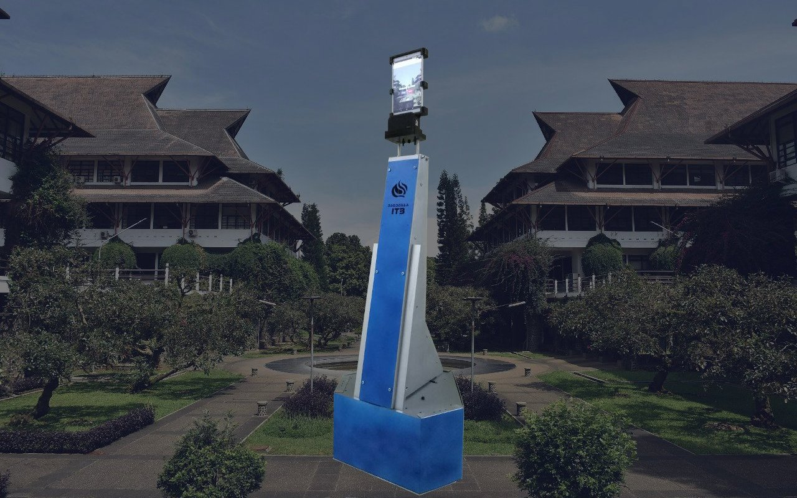
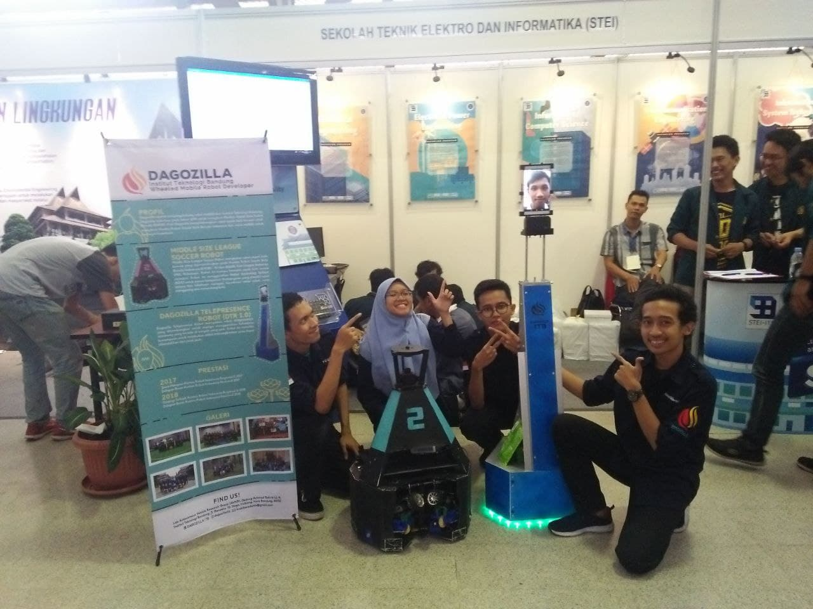

---
hide:
  - footer
---

# Dagozilla Telepresence Robot

*A telepresence robot that is designed to represent its user. The robot can be controlled via the internet, and will stream its user's face and voice.*

---

/// caption
Dagozilla Telepresence Robot
///

In 2018, I worked on the **Dagozilla Telepresence Robot** as one of [[dagozilla.md|Dagozilla's]] electrical engineers. The telepresence robot is designed to act as a representative of its user, who operates it remotely, wherever the user may be. The robot can stream the user's face and voice while being controlled through the internet. Its tablet height can be adjusted by the user to suit the user's needs. The user can use the robot for various purposes such as attending a meeting and checking around the environment.

The robot uses both a **Raspberry Pi 3B+** and an **STM32F446RE** microcontroller as its computing units. Its neck supports a **Xiaomi tablet** which acts as its user interface.

/// caption
The telepresence robot in Institut Teknologi Bandung Open House 2019
///

As an electrical engineer, I was in charge of the robot's overall electrical system. Specifically, I was responsible for designing, manufacturing, and implementing its tablet height adjustment electrical systems and control. I also implemented the robot's odometry system, I designed the PCBs and wrote the code for the sensor's data acquisition routine. Through the robot's manufacturing process, I actively participated in the robot's assembly and wiring process.

[[projects/index|Back to Projects]]